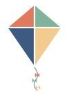

# rapp-kited-twin

The **kited twin** — the visual identity of the RAPP kited neighborhood. A simple **kite**: the smart
part stays anchored where your data lives, and you hold the string from whatever device you're on.
When a twin is *kited* (hosting), it shows this mark over a **scan‑to‑join** QR — the canonical sign
of a live, hosted neighborhood, and the thing an adopter can't unsee.

## The mark

- **Four panels on point**, forming a diamond kite, in a neutral earth‑tone palette:
  coral `#e07a5f`, sage `#81b29a`, sand `#f2cc8f`, slate `#3d5a80`.
- White seams down the spine and across the spar; a short tail with three bows.
- **No third‑party branding.** The mark is neutral and fully ownable — it stands for the kited twin
  itself, not anyone else's logo.

## Files

- `kited-twin.svg` — the canonical mark (scalable, transparent).
- `kite-mark.svg` — legacy filename, same neutral mark (back‑compat for older references).

Part of the RAPP ecosystem — see the [map](https://github.com/kody-w/rapp-map). MIT © Kody Wildfeuer.
